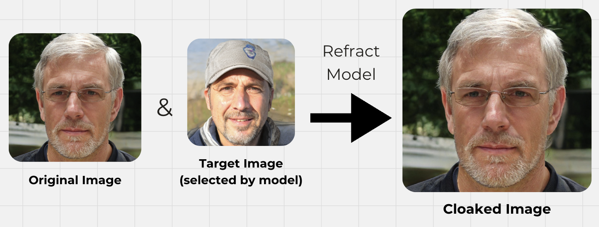

# Refract: Protect Your Digital Identity

## Team Members
- Ysabel Chen
- Gen Tamada
- Emily Tian
- Jesus Velarde
- Christy Yu

---
## Overview

Refract is a cutting-edge tool designed to cloak photos of individuals, safeguarding them against:
- Unauthorized training for deepfakes.
- Facial recognition systems.
- Other harmful forms of identity theft.

Our approach involves subtly altering images at the feature level to disrupt the ability of image-processing models to identify individuals. Refract ensures these changes are:
- **Human imperceptible**: Visual differences are nearly undetectable.
- **Highly effective**: Alters feature-identifying capabilities of image-processing models.

With Refract, individuals can confidently upload photos to social media, mitigating the risks associated with facial recognition technologies, identity theft, and deepfake generators.

---

## How It Works

1. **Target Image Selection**: Refract identifies a target image similar to the input photo.
2. **Feature Space Alteration**: 
   - Introduces subtle changes to the original image to match the target photo’s feature space.
   - Alternatively, modifies the input photo to maximize changes in its own feature space.
3. **Visual Consistency**: The final image retains strong visual similarity to the original photo while disrupting model-identifying capabilities.

---

## Features
- **Multiple Iterations**: Experimented with five model iterations, refining the process for optimal results.
- **User Customization**: A demo frontend includes sliders for adjusting:
  - Cloak strength.
  - Other parameters for balancing safety and visual distortion.
- **Alternative Methods**: Explored approaches including:
  - Altering the feature space of the source image itself.
  - Mimicking the feature space of a similar-looking target image.

---

## Technology Stack

### Backend

- **AWS Infrastructure**:
  - QueueJob for task scheduling.
  - S3 buckets for secure image storage.
  - EC2 instances for model hosting and computation.
- **Model Framework**:
  - Built using **PyTorch** for deep learning and adversarial techniques.

### Frontend
- **React Web Application**:
  - Hosted on **Vercel** for seamless deployment.
  - Interactive sliders for user customization.

---

## Key Achievements
- Successfully demonstrated the ability to alter photos on the feature level while maintaining visual fidelity.
- Created a scalable and user-friendly tool for protecting identity online.
- Developed a flexible and robust system that integrates modern cloud infrastructure with advanced machine learning.

---
## How to Use
1. Upload a photo to the demo interface.
2. Adjust the sliders to set cloak strength and other parameters.
3. Download your cloaked image and share it confidently!

---

## Why Refract Matters
Refract addresses growing concerns about privacy and security in the digital age. By disrupting the feature-identifying capabilities of image-processing systems, we empower individuals to take control of their digital identity.

---

For more details, visit our project or contact the team!

---

Demo: [Refract](https://refract-two.vercel.app/)